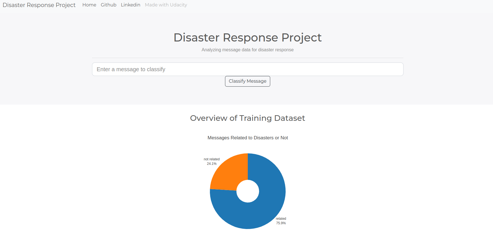
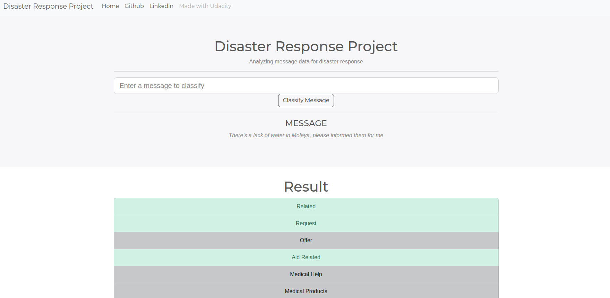

<h1> Disaster Response Pipeline Project </h1>

- [Context](#context)
- [Instructions](#instructions)
- [Interface](#interface)
- [Acknowledgments](#acknowledgments)

# Context
The project consists of a Flask app using an NLP machine learning pipeline to classify emergency messages.

It is composed of three stages:
1. Data cleaning pipeline: it takes disaster messages' historical data, cleans it, and saves it in a database.
2. NLP pipeline: reads the historical data from the database, trains an NLP model, and saves. 
3. Flask app: an interface where users can see historical data statistics and classify their messages.

# Instructions
Follow the guidelines below to run the app:

1. It's recommended to start a virtual environment.

2. Clone this repository: 
   `git clone git@github.com:TamirisCrepalde/disaster-response-pipeline.git`.

3. Install the required libraries by running the command: `pip install -r requirements.txt`.

4. Run the ETL pipeline that cleans the data and stores it on a database: `python data/process_data.py data/disaster_messages.csv data/disaster_categories.csv data/DisasterResponse.db`

5. Run the ML pipeline that trains the classifier and saves the model: `python models/train_classifier.py data/DisasterResponse.db models/classifier.pkl`.

6. Go to `app` directory: `cd app`.

7. Run the Flask app: `python run.py`.

8. Click the `PREVIEW` button to open the homepage.

# Interface
The home page of the Flask app has the following design:

After entering the message and clicking on the classifying button, the results are shown on the following page:

# Acknowledgments
This project was developed as part of the Udacity Data Scientist Nanodegree. The data used in the model training was provided by Figure Eight.